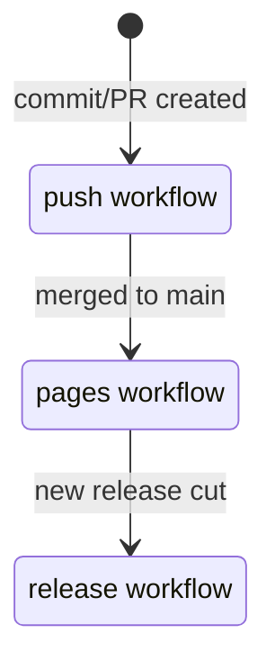
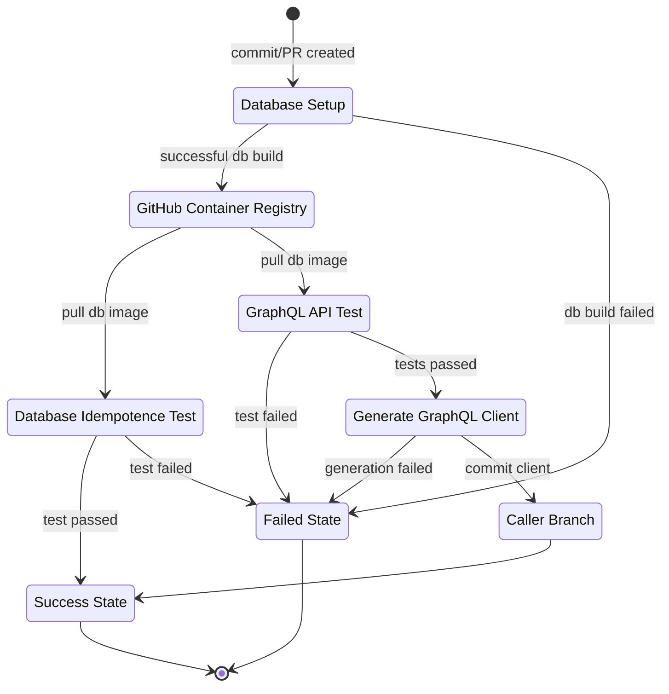
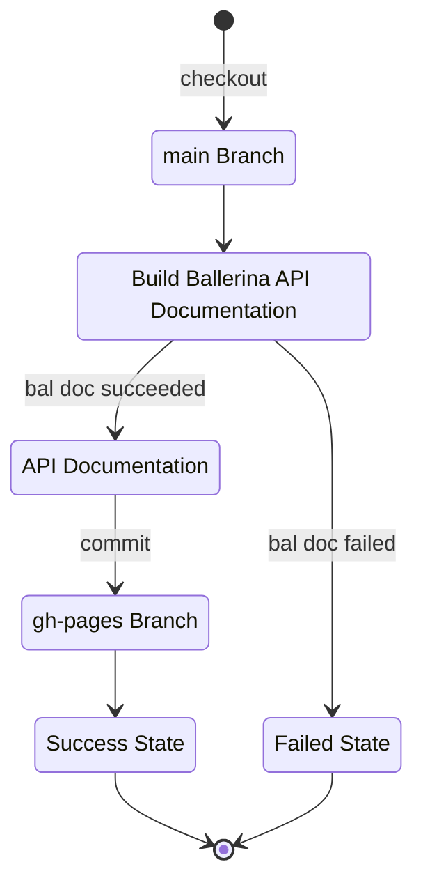
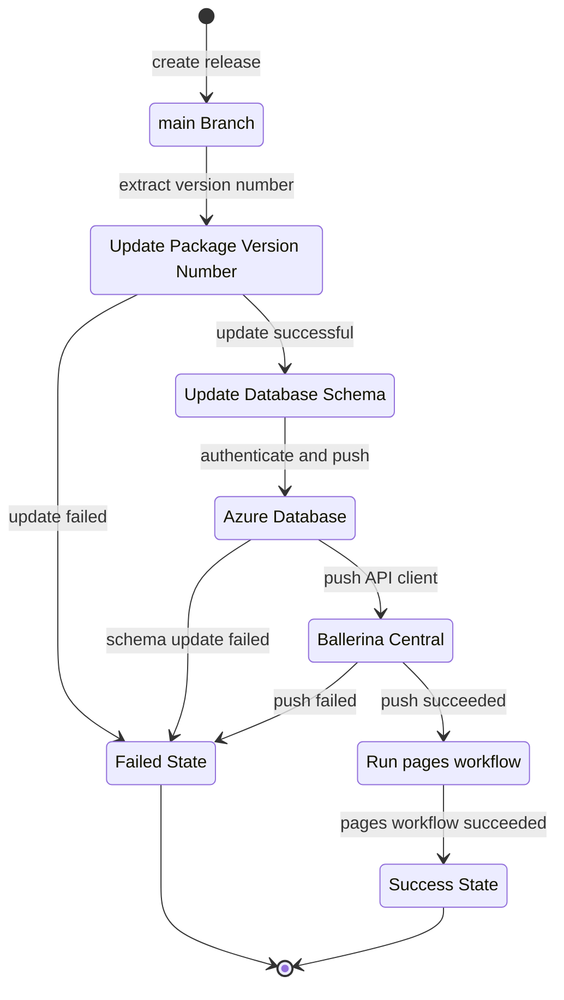

# Avinya Foundation Global Data Service

The Avinya Foundation's Global Data Service underlies the Avinya Foundation technology stack, and provides a universal interface to foundation data to all applications in the organization.

## Features

The global data service provides a generalized interface to foundation data for all internal clients at the Avinya Foundation. This includes applications across many domains; human resource management, student admissions, enterprise resource planning, and class management.

The main features are:

- Ballerina GraphQL API that exposes a semantically enriched global database;
- Generated Ballerina GraphQL client to query the API;
- Automated deployment and management of the GraphQL API on [Choreo](https://wso2.com/choreo/);
- Generalized data model to ensure interoperability and persistence across application domains in the organization;
- Robust test infrastructure, locally, and in the cloud.

## Component Documentation

- [GraphQL API Ballerina Documentation](https://avinya-foundation.github.io/global-data/api_doc/)
- [GraphQL Client Ballerina Documentation (on Central)](https://lib.ballerina.io/avinyafoundation/global_data_client/latest)

## Project Status

### Build and Test | 

*Build project and run tests*

Builds database container, and pushes to `ghcr.io`. Builds the `api/` ballerina project, and runs tests. Generates GraphQL client from the schema in `api/schema`.

### Generate Project Documentation | 

*Generate project documentation*

Use `bal doc` to build ballerina API documentation for the `api`. Adds these artifacts to the `gh-pages` branch, and sets up a Jekyll site with the [Cayman](https://github.com/pages-themes/cayman) theme.

### Release Pipeline | 

*Main `global-data` release workflow*

Bumps the project version numbers in `Ballerina.toml` files based on the release tag. Updates Microsoft Azure database schemas. Pushes GraphQL API client to Ballerina Central.

## Development

> Note: GitHub Pages does not yet support mermaid. To see rendered diagrams, look at the [project `README` on GitHub](https://github.com/Avinya-Foundation/global-data#readme).

### CI/CD

Global Data Service uses [GitHub Actions](https://github.com/features/actions) for managing CI/CD. Local pipeline execution is enabled with [act](https://github.com/nektos/act).

The logical setup of the GitHub Actions workflows is illustrated below. The actions are divided into 3 functionally separate workflows; `push`, `pages`, and `release`.

> Note: In all workflows, all paths must evaluate to the `Success State`, or the workflow fails.

These actions run at different points in the development lifecycle. The relationship between the 3 workflows, and detail for each of the workflows are illustrated below:

- Meta workflow

- [`push`](.github/workflows/push.yml) workflow

- [`pages`](.github/workflows/pages.yml) workflow

- [`release`](.github/workflows/release.yml) workflow

### Local Workflow Execution Notes

> Note: "Local" means running the tests on the developer's machine with [`act`](https://github.com/nektos/act).

- Need to change `HOST` to `localhost` in `tests/Config.toml` for local tests to run correctly.
- The [`Makefile`](Makefile) contains recipes for running the push pipeline with `act`.
- Some tests are duplicated with local-only logic. Specifically, all tests that require the database container have duplicate logic for local execution due to a limitation with `act` and [GitHub service containers](https://docs.github.com/en/actions/using-containerized-services/about-service-containers). For more information, see https://github.com/nektos/act/issues/173.
